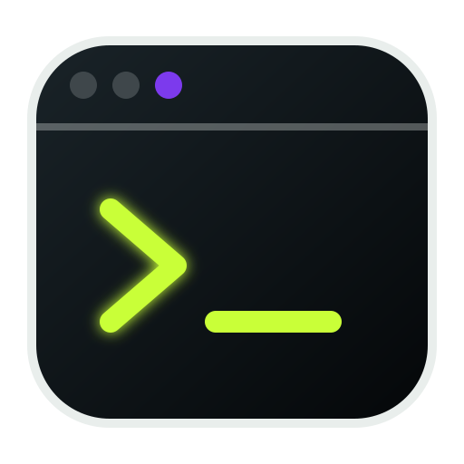

<p align="center">
  
</p>

<h1 align="center">Codex Crew</h1>

<p align="center">
  A persistent, local-first agent workspace powered by Codex CLI and explicit OpenAI-compatible access keys.
</p>

## What this fork is

Codex Crew 0.7 is a public, independently branded fork of Kiro Crew. It keeps
the dashboard, desktop shell, persistent sessions, memory, scheduled work,
MCP tools, messaging channels, security controls, and app platform while
replacing the public model-provider surface.

Only two agent backends are selectable:

- **Codex CLI**, the default, using the account configured by `codex login`.
- **OpenAI-compatible**, using an explicit access key stored in Codex Crew's
  encrypted secret vault. The built-in FreeChain profile is first, and custom
  Chat Completions endpoints can be added alongside it.

The OpenAI-compatible adapter refuses to start without an access key. Claude,
Kimi, Kiro, and other inherited harnesses are not selectable, installed, or
offered by this public build.

## Drive Sentinel

Drive Sentinel is installed and enabled as a built-in app. It is a distinct
Codex Crew edition derived from DiskWarden 1.3.0, with a terminal-style green
and amber interface, its own app identity, and stricter public defaults:

- No scan begins until the operator selects and requests one.
- A cleanup target is accepted only when the selected root matches the index.
- Unattended non-dry sweeps are limited to safe targets on the Windows system
  drive.
- Every app request is authenticated by the Codex Crew proxy, and cross-site
  browser requests are refused.
- Cleanup is a dry run unless the operator explicitly applies it.
- Audit records live under the configured Codex Crew data home, and cleanup is
  refused when that log cannot be opened.
- Review and danger tiers remain report-only.
- The bundled backend is managed by Codex Crew, with no private standalone
  launch paths or prompt-driven scheduler edits.

## Quick start from source

Prerequisites:

- Python 3.12 or newer
- Node.js 22 or newer
- Codex CLI, installed and authenticated with `codex login`
- The Codex ACP adapter, installed with
  `npm install -g @agentclientprotocol/codex-acp@1.10.0`

```bash
git clone https://github.com/mikutellyourworld/Codex-Crew.git
cd Codex-Crew
python -m venv .venv
.venv/Scripts/pip install -e ".[dev]"
cd website
npm ci
npm run build
cd ..
.venv/Scripts/codexcrew gateway
```

On macOS or Linux, use `.venv/bin/pip` and `.venv/bin/codexcrew` instead.
The dashboard listens on `http://127.0.0.1:5486` by default.

## Provider setup

Codex is the default backend:

```bash
codex login
codexcrew gateway
```

For FreeChain or another OpenAI-compatible endpoint, open **Settings**, then
**OpenAI-compatible profiles**. Add the base URL, model, and access key. Keys
are stored separately from shareable profile metadata and are redacted from
provider errors and child MCP environments.

## Data and privacy

Runtime data lives under `~/.codex-crew`. Override it with `CODEXCREW_HOME`.
Secrets do not belong in repository configuration, profile metadata, logs, or
support bundles. Review [SECURITY.md](SECURITY.md) before exposing a remote
gateway.

## Development

Backend checks:

```bash
python -m pytest
python scripts/check_black_formatting.py
python scripts/check_subprocess_encoding.py
flake8 src/codex_crew test
mypy src/codex_crew
```

Frontend checks:

```bash
cd website
npm run build
npm run test
```

Architecture and subsystem documentation starts at [docs/README.md](docs/README.md).

## Attribution and license

Codex Crew is licensed under the Apache License 2.0. It is based on Kiro Crew
and includes a Drive Sentinel derivative based on DiskWarden. See
[NOTICE](NOTICE) and [LICENSE](LICENSE) for attribution and terms.
