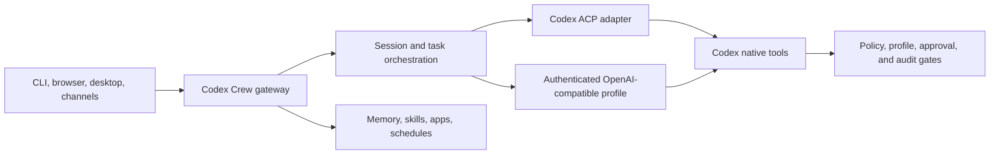

# Architecture overview

Codex Crew is a local-first agent gateway. One Python process serves the web
dashboard, owns sessions and scheduling, loads apps, and streams model events to
the connected clients.

## Runtime shape

## Components

- `src/codex_crew/cli.py` and `cli_server.py` boot the gateway and HTTP surface.
- `src/codex_crew/providers` adapts session consumers to the ACP provider.
- `src/codex_crew/acp` owns subprocess protocol, streaming, usage, and cleanup.
- `src/codex_crew/acp_adapters/openai_compatible_server.py` implements the
  authenticated OpenAI-compatible transport.
- `src/codex_crew/codex_tool_gate.py` installs the Codex native tool hook.
- `src/codex_crew/session.py` and `session_manager.py` own session lifecycle.
- `src/codex_crew/apps` discovers and serves built-in and installed apps.
- `website` is the React dashboard. `website/electron` is the desktop shell.

## Public provider boundary

The public registry exposes only `codex` and `openai_compatible`. Codex is the
default. OpenAI-compatible profiles require a base URL, model, and API key.
Unsupported persisted backend values normalize to Codex and do not reach
inherited compatibility paths.

The desktop build stages a pinned Codex ACP adapter beside the Python package.
Electron supplies its own executable as the Node runner, so the installed app
does not depend on a system Node installation.

## Data and trust boundaries

The default data home is `~/.codex-crew`. `CODEXCREW_HOME` can isolate another
instance. Credentials and security policy remain outside the source tree.

Tool authorization is the intersection of the immutable security policy, the
active profile, and any interactive approval. The tightest rule wins. Codex
native tools reach the same policy through the generated PreToolUse hook.

Drive Sentinel is a built-in app with its own backend and visual identity. It is
enabled by default, does not scan at gateway startup, and restricts unattended
non-dry cleanup to system-drive targets.

## Message flow

1. A client sends a message to the gateway.
2. The gateway selects or creates the requested session.
3. Context, memory, skills, and attachments are assembled.
4. The provider streams text, usage, and tool requests.
5. Tool requests pass through security and approval gates.
6. The response and usage record are persisted and streamed to the client.

## Further reading

- [Providers](../system-specs/modules/providers.md)
- [ACP client](../system-specs/modules/acp-client.md)
- [Security](security-deep-dive.md)
- [Apps and MCP](mcp.md)
- [Installation](../guides/install.md)
